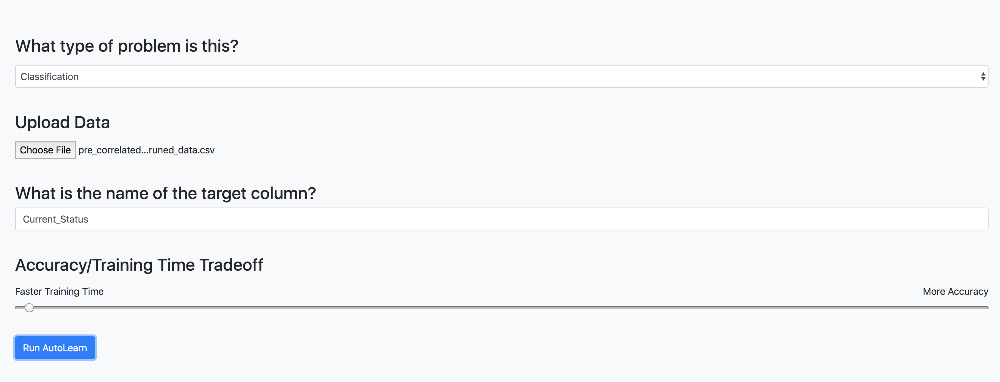
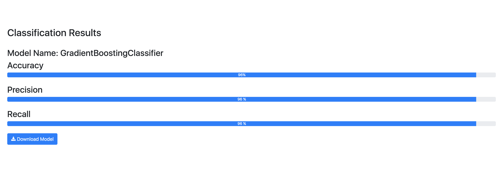
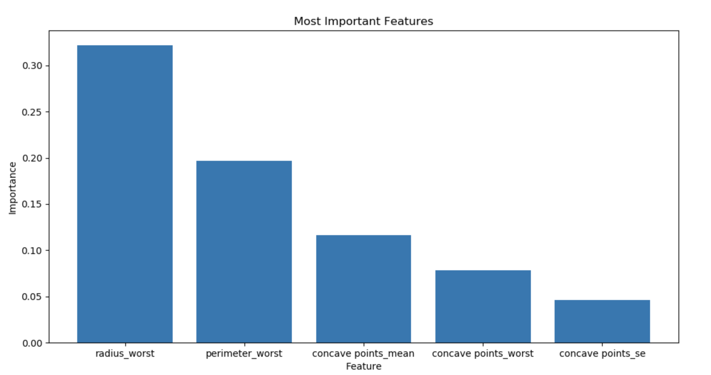

# AutoML-HackUTD19

This repo contains our implementation of AutoLearn.AI, a web app that automatically cleans
data and optimizes machine learning pipelines and provides the user with the best performing
models.

This app was built using Flask and the Python TPOT library.

## Features

### Automatically Optimize ML Pipelines For a Dataset

### Obtain Results and Download the Best Model

### Visualize the Feature Importances

## Software Prerequisites

This app makes use of the following frameworks and libraries:

- Python 3.5
- Numpy
- Pandas
- Matplotlib
- Scikit-learn
- TPOT
- XGBoost
- Flask
- werkzeug

## How to run this app locally

Navigate to the root directory of the project and run the command **flask run**.
Open up a browser and navigate to the address on localhost where the app is running in your terminal.